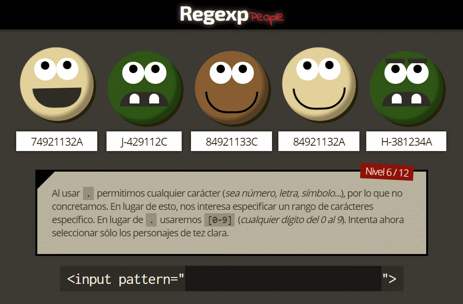

# Regexp People

A regular expression (for HTML5 `<input>` pattern attribute) learning game for newbies

## Preview

**» Game URL**: [https://manzdev.github.io/regex-people/](https://manzdev.github.io/regex-people/)

## Used tools

- NodeJS/NPM [https://nodejs.org/en/](https://nodejs.org/en/)
- ParcelJS [https://parceljs.org/](https://parceljs.org/)
- PostCSS [https://postcss.org/](https://postcss.org/)
- BabelJS [https://babeljs.io/](https://babeljs.io/)
- CSSNano [http://cssnano.co/](http://cssnano.co/)
- StyleLint [https://stylelint.io/](https://stylelint.io/)
- TypeScript [https://www.typescriptlang.org/](https://www.typescriptlang.org/)
- Lodash [https://lodash.com/](https://lodash.com/)
- Snarkdown [https://github.com/developit/snarkdown](https://github.com/developit/snarkdown)

## Author

Created by [@Manz](https://twitter.com/Manz) - [HTML5/CSS3/Javascript Cheatsheet author](https://lenguajehtml.com/)